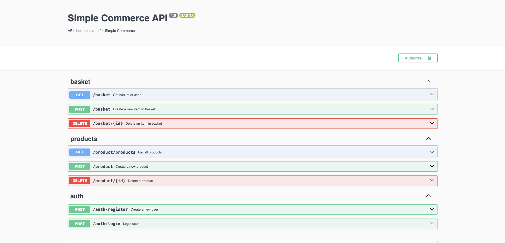

# Simple Commerce App

    

## Available Scripts

In the project directory, you can run:

### `mvn clean install`
### `javac -jar target/simple-commerce-0.0.1-SNAPSHOT.jar`

**! It will run the spring boot app in local  !**

### `docker-compose up -d --build`

**! It will run the nestjs in docker container and also create a postgre sql docker container  !**

### Swagger UI
http://localhost:3000/api/docs

